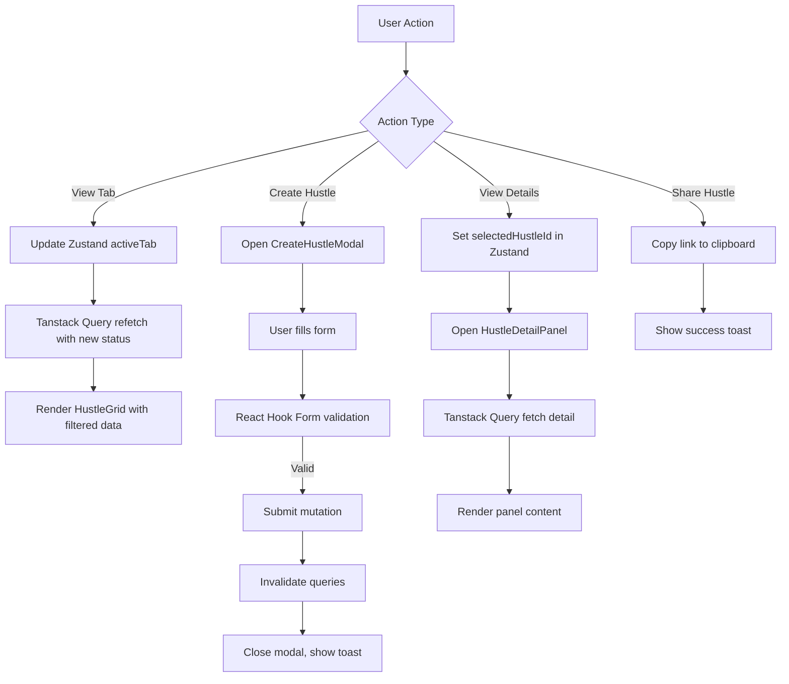

# Design Document: Hustle Management UI

## Overview

The Hustle Management UI feature provides a comprehensive interface for users to create, view, and manage their job postings (hustles). This feature consists of three primary components:

1. **My Hustles Page**: A tabbed dashboard displaying hustles organized by lifecycle status (Created, In-progress, Pending approval, Completed, Reviews)
2. **Create Hustle Form**: A modal form with rich text editing, file uploads, and comprehensive validation for creating new hustles
3. **Hustle Detail Panel**: A side panel displaying complete hustle information including job description, applicants, media gallery, and sharing capabilities

The implementation leverages React 19 with React Router v7 for navigation, React Hook Form with Zod for form validation, Zustand for UI state management, Tanstack Query for server state, and Framer Motion for animations. The design follows the existing application patterns established in the auth and wallet features.

### Key Design Principles

- **Component Composition**: Reuse existing shared components (Button, Input, GlassCard) and create new reusable components for hustle-specific UI elements
- **State Separation**: Server state managed by Tanstack Query, UI state (tabs, modals, filters) managed by Zustand
- **Progressive Enhancement**: Forms work without JavaScript, animations enhance but don't block functionality
- **Accessibility**: Keyboard navigation, ARIA labels, focus management for modals and panels
- **Performance**: Lazy loading for images, virtualization for long lists, optimistic updates for mutations

## Architecture

### Component Hierarchy

```
MyHustlesPage
├── StatusTabs
│   └── TabButton (x5)
├── HustleGrid
│   └── HustleCard (x N)
│       └── ViewDetailsButton
├── EmptyState
│   └── CreateHustleButton
├── CreateHustleButton (header)
└── CreateHustleModal (conditional)
    ├── ModalHeader
    ├── CreateHustleForm
    │   ├── BasicInfoSection
    │   │   ├── Input (title)
    │   │   └── CategorySelect
    │   ├── DateTimeSection
    │   │   ├── DateRangePicker
    │   │   └── TimeRangePicker
    │   ├── LocationBudgetSection
    │   │   ├── Input (location)
    │   │   ├── Input (budget)
    │   │   └── Input (duration)
    │   ├── ExperienceLevelSection
    │   │   └── RadioGroup
    │   ├── SkillsSection
    │   │   ├── SkillInput
    │   │   └── SkillChip (x N)
    │   ├── DescriptionSection
    │   │   └── RichTextEditor
    │   └── FileUploadSection
    │       ├── FileDropzone
    │       └── FilePreview (x N)
    └── FormActions
        ├── ClearDraftButton
        └── SubmitButton

HustleDetailPanel (conditional)
├── PanelHeader
│   ├── CloseButton
│   └── ShareButton
├── DetailTabs
│   ├── JobDescriptionTab
│   │   ├── HustleMetadata
│   │   ├── DescriptionContent
│   │   ├── SkillChips
│   │   ├── DocumentList
│   │   └── MediaGallery
│   └── ApplicantsTab
│       ├── ApplicantCount
│       └── ApplicantList
│           └── ApplicantCard (x N)
└── PanelActions
```

### State Management Architecture

**Zustand Store (hustles.store.js)**
- `activeTab`: Currently selected status tab (Created, In-progress, etc.)
- `selectedHustleId`: ID of hustle displayed in detail panel
- `filters`: Search and filter criteria for feed
- `createModalOpen`: Boolean for create form visibility
- `detailPanelOpen`: Boolean for detail panel visibility
- `formDraft`: Auto-saved form data for recovery

**Tanstack Query Cache**
- `hustles.mine({ status })`: List of user's hustles by status
- `hustles.detail(id)`: Single hustle details
- `hustles.categories`: Available categories for dropdown
- Automatic refetching, caching, and invalidation on mutations

**React Hook Form State**
- Form field values and validation errors
- Dirty state tracking for unsaved changes warning
- File upload progress and preview state

### Data Flow



## Components and Interfaces

### Core Components

#### MyHustlesPage

**Purpose**: Main container page for viewing and managing user's hustles

**Props**: None (uses hooks for data)

**State**:
- `activeTab` from Zustand
- `hustles` from `useMyHustles()`
- `createModalOpen` from Zustand

**Responsibilities**:
- Render status tabs with counts
- Display hustle grid or empty state
- Handle tab switching
- Manage create modal visibility

**Key Methods**:
- `handleTabChange(tab)`: Update active tab in store
- `handleCreateClick()`: Open create modal
- `handleViewDetails(hustleId)`: Open detail panel

#### HustleCard

**Purpose**: Display summary information for a single hustle

**Props**:
```typescript
interface HustleCardProps {
  hustle: {
    id: string
    title: string
    description: string
    image?: string
    applicantCount: number
    postedAt: string
    experienceLevel: 'beginner' | 'intermediate' | 'expert'
    duration: string
    amount: number
    status: string
  }
  onViewDetails: (id: string) => void
}
```

**Rendering**:
- Image with fallback gradient
- Title (truncated to 2 lines)
- Description preview (truncated to 3 lines)
- Metadata badges (experience level, duration, amount)
- Applicant count and posted time
- "View more details" button

#### CreateHustleModal

**Purpose**: Modal container for hustle creation form

**Props**:
```typescript
interface CreateHustleModalProps {
  isOpen: boolean
  onClose: () => void
}
```

**Features**:
- Framer Motion slide-in animation from right
- Backdrop click to close (with unsaved changes warning)
- Escape key to close
- Focus trap for accessibility
- Scroll lock on body when open

#### CreateHustleForm

**Purpose**: Form for creating a new hustle with validation

**Form Schema** (Zod):
```typescript
const createHustleSchema = z.object({
  title: z.string()
    .min(5, 'Title must be at least 5 characters')
    .max(100, 'Title must not exceed 100 characters'),
  category: z.string().min(1, 'Category is required'),
  startDate: z.date(),
  endDate: z.date(),
  startTime: z.string().regex(/^([0-1]?[0-9]|2[0-3]):[0-5][0-9]$/),
  endTime: z.string().regex(/^([0-1]?[0-9]|2[0-3]):[0-5][0-9]$/),
  duration: z.string().min(1, 'Duration is required'),
  location: z.string().min(1, 'Location is required'),
  budget: z.number()
    .positive('Budget must be positive')
    .min(1, 'Budget is required'),
  experienceLevel: z.enum(['beginner', 'intermediate', 'expert']),
  skills: z.array(z.string())
    .min(1, 'At least one skill is required')
    .max(5, 'Maximum 5 skills allowed'),
  description: z.string()
    .min(20, 'Description must be at least 20 characters'),
  files: z.array(z.instanceof(File)).optional()
}).refine((data) => data.endDate >= data.startDate, {
  message: 'End date must be after start date',
  path: ['endDate']
}).refine((data) => {
  if (data.startDate.getTime() === data.endDate.getTime()) {
    return data.endTime > data.startTime
  }
  return true
}, {
  message: 'End time must be after start time',
  path: ['endTime']
})
```

**State Management**:
- React Hook Form for field state and validation
- Local storage for draft persistence (auto-save every 2 seconds)
- File upload state for progress and previews

**Key Methods**:
- `handleSubmit(data)`: Transform form data to FormData, call mutation
- `saveDraft()`: Persist current form state to localStorage
- `loadDraft()`: Restore form state from localStorage
- `clearDraft()`: Remove draft from localStorage

#### RichTextEditor

**Purpose**: WYSIWYG editor for hustle description

**Props**:
```typescript
interface RichTextEditorProps {
  value: string
  onChange: (value: string) => void
  error?: string
  placeholder?: string
}
```

**Implementation**: Use TipTap or Lexical for rich text editing

**Toolbar Buttons**:
- Bold, Italic, Underline
- Text alignment (left, center, right)
- Bulleted list, Numbered list
- Link insertion
- Clear formatting

**Output Format**: HTML string stored in database

#### FileUploadComponent

**Purpose**: Drag-and-drop file upload with previews

**Props**:
```typescript
interface FileUploadComponentProps {
  files: File[]
  onChange: (files: File[]) => void
  accept: string
  maxFiles?: number
  maxSize?: number
}
```

**Features**:
- Drag-and-drop zone with visual feedback
- Click to browse file picker
- File type validation (SVG, PNG, JPG, GIF)
- File size validation (max 5MB per file)
- Preview thumbnails with remove button
- Progress indicators during upload
- Error messages for invalid files

**State**:
- `dragActive`: Boolean for drag-over styling
- `uploadProgress`: Map<filename, percentage>
- `errors`: Array of validation error messages

#### HustleDetailPanel

**Purpose**: Side panel displaying complete hustle information

**Props**:
```typescript
interface HustleDetailPanelProps {
  hustleId: string
  isOpen: boolean
  onClose: () => void
}
```

**Features**:
- Framer Motion slide-in from right
- Tabbed interface (Job Description, Applicants)
- Share functionality with clipboard copy
- Media gallery with lightbox for images
- Video player for video attachments
- Document list with download links

**Data Loading**:
- Uses `useHustle(hustleId)` hook
- Loading skeleton while fetching
- Error state with retry button

### Shared Components (Reused)

- **Button**: Primary, solid, ghost, outline, text variants
- **Input**: Text, email, number, date, time inputs with validation
- **GlassCard**: Not used in this feature (auth-specific)

### New Shared Components (Created for this feature)

#### SkillChip

**Purpose**: Display a skill tag with optional remove button

**Props**:
```typescript
interface SkillChipProps {
  label: string
  onRemove?: () => void
  variant?: 'default' | 'outlined'
}
```

**Styling**:
- Rounded pill shape
- Primary color background
- White text
- Remove button (X icon) when `onRemove` provided

#### StatusBadge

**Purpose**: Display hustle status with color coding

**Props**:
```typescript
interface StatusBadgeProps {
  status: 'created' | 'in-progress' | 'pending-approval' | 'completed' | 'reviews'
}
```

**Color Mapping**:
- Created: Yellow (--color-secondary)
- In-progress: Blue (--color-info)
- Pending approval: Orange (--color-warning)
- Completed: Green (--color-success)
- Reviews: Purple

#### EmptyState

**Purpose**: Display when no hustles exist in a tab

**Props**:
```typescript
interface EmptyStateProps {
  title: string
  description: string
  action?: {
    label: string
    onClick: () => void
  }
  illustration?: string
}
```

**Rendering**:
- Centered layout
- Illustration image or icon
- Title and description text
- Optional action button

## Data Models

### Hustle Entity

```typescript
interface Hustle {
  id: string
  creatorId: string
  title: string
  description: string // HTML string from rich text editor
  category: string
  startDate: string // ISO 8601
  endDate: string // ISO 8601
  startTime: string // HH:mm format
  endTime: string // HH:mm format
  duration: string // e.g., "2 weeks", "1 month"
  location: string
  budget: number
  experienceLevel: 'beginner' | 'intermediate' | 'expert'
  skills: string[]
  status: 'created' | 'in-progress' | 'pending-approval' | 'completed' | 'reviews'
  applicantCount: number
  images: MediaFile[]
  videos: MediaFile[]
  documents: DocumentFile[]
  createdAt: string // ISO 8601
  updatedAt: string // ISO 8601
}

interface MediaFile {
  id: string
  url: string
  filename: string
  mimeType: string
  size: number
  width?: number
  height?: number
}

interface DocumentFile {
  id: string
  url: string
  filename: string
  mimeType: string
  size: number
}
```

### Form Data Structure

```typescript
interface CreateHustleFormData {
  title: string
  category: string
  startDate: Date
  endDate: Date
  startTime: string
  endTime: string
  duration: string
  location: string
  budget: number
  experienceLevel: 'beginner' | 'intermediate' | 'expert'
  skills: string[]
  description: string // HTML
  files: File[]
}
```

### API Request/Response

**POST /hustles**

Request (multipart/form-data):
```typescript
{
  title: string
  category: string
  startDate: string
  endDate: string
  startTime: string
  endTime: string
  duration: string
  location: string
  budget: number
  experienceLevel: string
  skills: string[] // JSON stringified
  description: string
  files: File[] // multipart files
}
```

Response:
```typescript
{
  data: Hustle
  message: string
}
```

**GET /hustles/mine?status={status}**

Response:
```typescript
{
  data: Hustle[]
  meta: {
    total: number
    page: number
    totalPages: number
  }
}
```

**GET /hustles/:id**

Response:
```typescript
{
  data: Hustle & {
    creator: {
      id: string
      name: string
      avatar?: string
    }
    applicants: Applicant[]
  }
}
```

### Local Storage Schema

**Draft Form Data**:
```typescript
// Key: 'hustle-draft'
{
  timestamp: number
  data: CreateHustleFormData
}
```

**Tab Persistence**:
```typescript
// Key: 'hustle-active-tab'
{
  tab: string // 'created' | 'in-progress' | etc.
}
```


## Correctness Properties

*A property is a characteristic or behavior that should hold true across all valid executions of a system—essentially, a formal statement about what the system should do. Properties serve as the bridge between human-readable specifications and machine-verifiable correctness guarantees.*

### Property Reflection

After analyzing all acceptance criteria, I identified the following redundancies and consolidations:

**Redundancies Eliminated:**
- Properties 8.3 and 8.4 (submit button disabled/enabled based on validation) can be combined into a single property about button state reflecting validation state
- Properties 5.3 and 5.4 (skill chip display and removal) can be combined into a comprehensive skill management property
- Properties 7.4 and 7.5 (file preview display and removal) can be combined into a comprehensive file management property
- Properties 10.3, 10.4, 10.5, 10.6, 10.7 (detail panel field display) can be combined into a single property about complete information display
- Properties 20.1 and 20.2 (media gallery display) are redundant with 10.6 and 10.7

**Properties Combined:**
- Date and time validation (4.3, 4.4) combined into a single date-time range validation property
- Form field validation properties (8.1, 8.2, 8.5, 8.6) combined into a comprehensive validation property
- Draft persistence properties (15.1, 15.2, 15.3, 15.4) combined into a round-trip persistence property

### Property 1: Tab Filtering Correctness

*For any* selected status tab and any set of hustles, all displayed hustles should have a status matching the selected tab, and no hustles with that status should be excluded.

**Validates: Requirements 1.3**

### Property 2: Hustle Count Accuracy

*For any* status tab and any set of hustles, the displayed count in the tab label should equal the actual number of hustles with that status.

**Validates: Requirements 1.2, 11.2**

### Property 3: Card Rendering Completeness

*For any* list of hustles in the current tab, the number of rendered HustleCard components should equal the number of hustles in that list.

**Validates: Requirements 2.1**

### Property 4: Card Information Completeness

*For any* hustle, the rendered HustleCard should contain the title, applicant count, posted time, image (or fallback), description preview, experience level, duration, and amount.

**Validates: Requirements 2.2**

### Property 5: Detail Panel Navigation

*For any* hustle card, clicking the "View more details" button should open the HustleDetailPanel with the selectedHustleId in state matching that hustle's ID.

**Validates: Requirements 2.4**

### Property 6: Date-Time Range Validation

*For any* form submission with start and end dates/times, validation should fail if: (a) end date is before start date, or (b) dates are equal and end time is not after start time.

**Validates: Requirements 4.3, 4.4**

### Property 7: Skills Management

*For any* skill added to the form, it should appear as a SkillChip in the UI, and removing that chip should remove the skill from the form data, with a maximum of 5 skills enforced.

**Validates: Requirements 5.2, 5.3, 5.4**

### Property 8: File Type Validation

*For any* file uploaded to the FileUploadComponent, if the file type is SVG, PNG, JPG, or GIF, it should be accepted; otherwise, it should be rejected with an error message.

**Validates: Requirements 7.2**

### Property 9: File Management

*For any* file successfully uploaded, a preview thumbnail should be displayed, and clicking the remove button on that preview should remove the file from the upload list.

**Validates: Requirements 7.4, 7.5**

### Property 10: Multiple File Upload Support

*For any* array of valid files (up to the maximum limit), all files should be accepted and displayed as previews in the upload component.

**Validates: Requirements 7.6**

### Property 11: Form Validation Completeness

*For any* form state, validation should fail if: (a) any required field is empty, (b) budget contains non-numeric characters, (c) title is not between 5-100 characters, or (d) description is less than 20 characters.

**Validates: Requirements 8.1, 8.2, 8.5, 8.6**

### Property 12: Submit Button State

*For any* form state, the submit button should be disabled if and only if validation errors exist or required fields are empty.

**Validates: Requirements 8.3, 8.4**

### Property 13: Rich Text Formatting Preservation

*For any* formatted text entered in the RichTextEditor, saving the form and then loading the hustle detail should preserve all formatting (bold, italic, underline, lists, links, alignment).

**Validates: Requirements 6.4**

### Property 14: API Submission Correctness

*For any* valid form data, clicking submit should trigger an API call with a payload containing all form fields in the correct format (dates as ISO strings, skills as array, files as multipart data).

**Validates: Requirements 9.1**

### Property 15: Successful Creation Updates UI

*For any* successful hustle creation, the new hustle should appear in the "Created" tab list after the API returns success.

**Validates: Requirements 9.4**

### Property 16: Error Display on Failure

*For any* API error response during form submission, the error message from the API should be displayed in the form, and the form should remain open.

**Validates: Requirements 9.5, 13.4**

### Property 17: Detail Panel Information Completeness

*For any* hustle displayed in the HustleDetailPanel, all fields (title, description, location, experience level, duration, amount, date range, time range, skills, documents, media) should be rendered with their correct values.

**Validates: Requirements 10.3, 10.4, 10.5, 10.6, 10.7**

### Property 18: Video Play Button Presence

*For any* video in the media gallery, a play button overlay should be displayed on the video thumbnail.

**Validates: Requirements 10.7, 20.2**

### Property 19: Tab State Persistence

*For any* selected status tab, navigating away from MyHustlesPage and returning should restore the same tab selection.

**Validates: Requirements 14.1, 14.2**

### Property 20: Draft Data Round-Trip

*For any* form data entered in the CreateHustleForm, closing the form without submitting and then reopening it should restore all field values from local storage.

**Validates: Requirements 15.1, 15.2, 15.3**

### Property 21: Draft Cleanup on Success

*For any* successful form submission, the draft data should be cleared from local storage.

**Validates: Requirements 15.4**

### Property 22: Category Inclusion in Payload

*For any* selected category in the form, the submission payload should include that category value.

**Validates: Requirements 16.4**

### Property 23: Category Validation

*For any* form submission without a selected category, validation should fail with an error message.

**Validates: Requirements 16.3**

### Property 24: Category Options from API

*For any* set of categories returned by the API, all categories should be displayed as options in the category dropdown.

**Validates: Requirements 16.2**

### Property 25: Media Gallery Grid Display

*For any* hustle with attached images or videos, the HustleDetailPanel should display them in a grid layout with consistent aspect ratios.

**Validates: Requirements 20.1, 20.4**

## Error Handling

### Form Validation Errors

**Strategy**: Client-side validation using Zod schema with React Hook Form

**Error Types**:
- **Required Field Errors**: Display inline error message below the field
- **Format Errors**: Display inline error message with format requirements
- **Range Errors**: Display inline error message with valid range
- **Custom Validation Errors**: Display inline error message with specific reason

**User Experience**:
- Errors appear on blur or on submit attempt
- Errors clear when user corrects the input
- Submit button disabled when errors exist
- Focus moves to first error field on submit attempt

### API Errors

**Strategy**: Centralized error handling in API client with feature-specific overrides

**Error Types**:

1. **Network Errors** (no response)
   - Display: "Unable to connect. Check your internet connection."
   - Action: Retry button
   - Logging: Log to error monitoring service

2. **Validation Errors** (400)
   - Display: Field-specific errors from API response
   - Action: User corrects fields
   - Example: `{ "errors": { "title": "Title already exists" } }`

3. **Authentication Errors** (401)
   - Display: "Session expired. Please sign in again."
   - Action: Redirect to sign-in page
   - Handled globally by API client

4. **Authorization Errors** (403)
   - Display: "You don't have permission to perform this action."
   - Action: Close modal, return to previous page

5. **Not Found Errors** (404)
   - Display: "Hustle not found. It may have been deleted."
   - Action: Close detail panel, refresh list

6. **Server Errors** (500)
   - Display: "Something went wrong. Please try again."
   - Action: Retry button
   - Logging: Log full error details to monitoring service

### File Upload Errors

**Error Types**:
- **Invalid File Type**: "Only SVG, PNG, JPG, and GIF files are allowed."
- **File Too Large**: "File size must be under 5MB."
- **Upload Failed**: "Failed to upload {filename}. Please try again."
- **Too Many Files**: "Maximum 10 files allowed."

**Handling**:
- Display error message below upload zone
- Highlight failed file in preview list
- Provide retry button for individual files
- Allow user to remove failed files and continue

### State Management Errors

**Zustand Store Errors**:
- Wrapped in try-catch blocks
- Fallback to default state on error
- Log errors to console in development

**Tanstack Query Errors**:
- Automatic retry (3 attempts with exponential backoff)
- Error state exposed via `isError` and `error` properties
- Stale data shown while refetching
- Manual refetch available via UI button

### Local Storage Errors

**Scenarios**:
- Storage quota exceeded
- Storage disabled by user
- Storage corrupted

**Handling**:
- Wrap all localStorage calls in try-catch
- Gracefully degrade (form works without draft persistence)
- Display warning: "Unable to save draft. Your browser storage may be full."

### Edge Cases

1. **Empty States**
   - No hustles in tab: Display EmptyState component
   - No applicants: Display "No applicants yet" message
   - No media: Hide media gallery section
   - No documents: Hide documents section

2. **Loading States**
   - Initial page load: Display skeleton grid
   - Tab switch: Display skeleton grid
   - Form submission: Display spinner on button
   - Detail panel load: Display skeleton content

3. **Concurrent Modifications**
   - User edits hustle in another tab: Show stale data warning
   - Hustle deleted while viewing: Show "Hustle no longer exists" error
   - Solution: Implement optimistic updates with rollback on conflict

4. **Browser Compatibility**
   - File API not supported: Disable file upload, show message
   - Local Storage not available: Disable draft persistence
   - Clipboard API not available: Fallback to manual copy for share

## Testing Strategy

### Dual Testing Approach

This feature requires both unit tests and property-based tests to ensure comprehensive coverage:

**Unit Tests**: Focus on specific examples, edge cases, error conditions, and integration points between components. Unit tests validate concrete scenarios and ensure components render correctly with specific data.

**Property-Based Tests**: Verify universal properties across all inputs using randomized test data. Property tests ensure correctness holds for the entire input space, not just hand-picked examples.

Together, these approaches provide comprehensive coverage: unit tests catch concrete bugs in specific scenarios, while property tests verify general correctness across all possible inputs.

### Property-Based Testing Configuration

**Library**: Use `@fast-check/vitest` for property-based testing in the React/TypeScript ecosystem.

**Configuration**:
- Minimum 100 iterations per property test (due to randomization)
- Each property test must reference its design document property
- Tag format: `// Feature: hustle-management-ui, Property {number}: {property_text}`

**Example Property Test Structure**:

```javascript
import { test } from 'vitest'
import fc from 'fast-check'

// Feature: hustle-management-ui, Property 1: Tab Filtering Correctness
test('tab filtering shows only hustles matching selected status', () => {
  fc.assert(
    fc.property(
      fc.array(hustleArbitrary()),
      fc.constantFrom('created', 'in-progress', 'pending-approval', 'completed', 'reviews'),
      (hustles, selectedTab) => {
        const filtered = filterHustlesByStatus(hustles, selectedTab)
        return filtered.every(h => h.status === selectedTab) &&
               hustles.filter(h => h.status === selectedTab).length === filtered.length
      }
    ),
    { numRuns: 100 }
  )
})
```

### Unit Testing Strategy

**Component Tests** (React Testing Library):
- Render tests: Verify components render without crashing
- Interaction tests: Simulate user interactions (clicks, typing, form submission)
- State tests: Verify component state updates correctly
- Integration tests: Test component interactions with hooks and stores

**Hook Tests** (@testing-library/react-hooks):
- Query hooks: Verify data fetching and caching
- Mutation hooks: Verify API calls and state updates
- Custom hooks: Verify business logic and side effects

**Store Tests** (Zustand):
- Action tests: Verify store actions update state correctly
- Selector tests: Verify derived state calculations
- Persistence tests: Verify localStorage integration

**Service Tests**:
- API client tests: Verify request formatting and response handling
- Mock API responses using MSW (Mock Service Worker)
- Test error scenarios and retry logic

### Test Coverage Goals

- **Statements**: 80% minimum
- **Branches**: 75% minimum
- **Functions**: 80% minimum
- **Lines**: 80% minimum

### Critical Test Scenarios

**MyHustlesPage**:
- Renders all status tabs with correct counts
- Filters hustles by selected tab
- Displays empty state when no hustles exist
- Opens create modal on button click
- Opens detail panel on card click
- Persists selected tab on navigation

**CreateHustleForm**:
- Validates all required fields
- Validates field formats (title length, budget numeric, etc.)
- Validates date/time ranges
- Manages skills (add, remove, max 5)
- Manages file uploads (add, remove, type validation)
- Preserves formatting in rich text editor
- Saves draft to local storage
- Restores draft on reopen
- Clears draft on successful submission
- Displays API errors
- Disables submit button when invalid

**HustleDetailPanel**:
- Displays all hustle information
- Renders skills as chips
- Displays documents with download links
- Displays media in gallery grid
- Shows play button on videos
- Switches between tabs
- Displays applicant count
- Shows empty state when no applicants
- Copies share link to clipboard

**HustleCard**:
- Displays all required fields
- Truncates long text
- Shows fallback image when no image
- Formats currency correctly
- Formats dates correctly

### Accessibility Testing

- Keyboard navigation (Tab, Enter, Escape)
- Screen reader compatibility (ARIA labels, roles, live regions)
- Focus management (modals trap focus, focus returns on close)
- Color contrast (WCAG AA minimum)
- Touch targets (minimum 44x44 pixels)

### Performance Testing

- Initial page load time (< 2 seconds)
- Time to interactive (< 3 seconds)
- Image lazy loading
- Infinite scroll performance (smooth scrolling with 100+ items)
- Form submission time (< 1 second for validation)

### Browser Compatibility Testing

- Chrome (latest 2 versions)
- Firefox (latest 2 versions)
- Safari (latest 2 versions)
- Edge (latest 2 versions)
- Mobile Safari (iOS 14+)
- Chrome Mobile (Android 10+)

### Integration Testing

- End-to-end tests using Playwright
- Critical user flows:
  1. Create hustle flow (open form → fill fields → submit → verify in list)
  2. View details flow (click card → view details → close panel)
  3. Tab switching flow (switch tabs → verify filtered list)
  4. Draft persistence flow (fill form → close → reopen → verify restored)
  5. Share hustle flow (open details → click share → copy link → verify)

